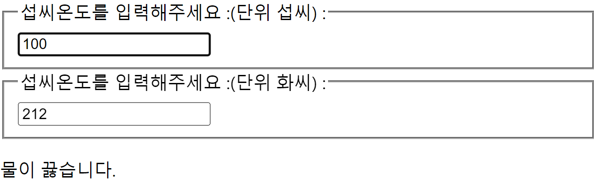

# 202030215 서민석

# 6월 11일
### Specialization(특수화, 전문화)
* Welcomedialog는 dialog의 특별한 케이스임.
* 범용적인 개념을 구별이 되게 구체화하는 것을 특수화라고 함.
* 객체지향 언어에서는 상속을 사용하여 특수화를 구현함.
* 리액트에서는 합성을 사용하여 특수화를 구현함.

### Containment와 Specialization 같이 사용하기
* Containment를 위해서 props.children을 사용하고, Specialization을 위해 직접 정의한 props를 사용하면 됨.
* Dialog 컴포넌트는 이전의 것과 비슷한데 Containment를 위해 끝부분에 props.children을 추가함.
* Dialog를 사용하는 SignUpDialog는 Specialization을 위해 props인 title, message에 값을 넣어주고 있고, 입력을 받기 위해 ```<input>```과 ```<button>```을 사용, 이 두개의 태그는 모두 props.children으로 전달되어 Dialog에 표시됨.
* 이러한 형태로 Containment와 Specialization을 동시에 사용할 수 있음.

### 상속에 대해 알아보기
* 합성과 대비되는 개념으로 상속(inheritance)이 있음.
* 자식 클래스는 부모 클래스가 가진 변수나 함수 등의 속성을 모두 갖게 되는 개념
* 리액트에서는 상속보다는 합성을 통해 새로운 컴포넌트를 생성
## 실습
* Card.jsx
```js
export default function Card(props) {
    const {title, backgroundColor, children} = props

    return (
        <div style={{backgroundColor: backgroundColor || 'white' }}>
            {title && <h1>{title}</h1>}
            {children}
        </div>
    )
}
```
* ProfileCard.jsx
```js
import Card from "./Card";

export default function ProfileCard() {
    return (
        <Card title="Inje Lee" backgroundColor="#4ea04e" >
        <p>안녕하세요</p>
        <p>리액트로 개발합니다.</p>
        </Card>
    )
}
```
* 결과창


### 컨텍스트란 무엇인가?
* 기존의 일반적인 리액트에서는 데이터가 컴포넌트의 props를 통해 부모에서 자식으로 단방향으로 전달되었음.
* 컨텍스트는 리액트 컴포넌트들 사이에서 데이터를 기존의 props를 통해 전달하는 방식 대신 컴포넌트 트리를 통해 곧바로 컴포넌트에 전달하는 새로운 방식을 제공함.
* 이 것을 통해 어떤 컴포넌트라도 쉽게 데이터에 접근 가능.
* 컨텍스트를 사용하면 일일이 props로 전달할 필요 없이 데이터를 필요로 하는 컴포넌트에 곧바로 데이터를 쓸 수 있음.

### 언제 컨텍스트를 사용해야 할까?
* 여러 컴포넌트에서 자주 필요로 하는 데이터는 로그인 여부, 로그인 정보, UI 테마, 현재 선택된 언어 등이 있음.
* 반복적인 코드를 사용해서 작성해 주어야 하기 때문에 비효율적이고 가독성이 떨어짐.
* 컨텍스트를 사용하면 이러한 방식을 깔끔하게 개선할 수 있음.

# 6월 5일

### Shared State
```ruby
같은 부모 컴포넌트의 state를 자식 컴포넌트가 공유해서 사용하는 것
```
* Shared state는 state의 공유를 의미
### Shared state 적용하기
```jsx
return (
    ...
    // 변경 전 : <input value={temperature} onChange={handleChange} />
    <input value={props.temperature} onChange={handleChange} />
)
```
* 다음은 하위 컴포넌트의 state를 부모 컴포넌트로 올려서 shared state를 적용함.
* 이것을 Lifting State up(State 끌어 올리기)라고 함
* 이를 위해 먼저 TemperatureInput 컴포넌트에서 온도 값을 가져오는 부분을 다음과 같이 수정
* 이렇게 수정하면 온도를 state에서 가져오지 않고 props를 통해 가져오게 됨.

### 온도 변환 함수 작성
* Calculator.jsx
```jsx
import { useState } from "react";
import TemperatureInput from "./TemperatureInput";

export default function Calculator() {
    const [temperature, setTemperature] = useState()
    const [scale, setScale] = useState('c')

    const handleCelsiusChange = (temperature) => {
        setTemperature(temperature)
        setScale('c')
    }

    const handleFahrenheitChange = (temperature) => {
        setTemperature(temperature)
        setScale('f')
    }

    const celsius = (scale === 'f' ? tryConvert(temperature, toCelsius) : temperature)
    const fahrenheit = (scale === 'c' ? tryConvert(temperature, toFahrenheit) : temperature)

    return (
        <>
            <TemperatureInput scale='c' temperature={celsius} onTemperatureChange ={handleCelsiusChange}/>
            <TemperatureInput scale='f' temperature={fahrenheit} onTemperatureChange ={handleFahrenheitChange}/>
            <BoilingVerdict celsius={parseInt(celsius)} />
        </>
    )
}

function BoilingVerdict(props) {
    if(props.celsius >= 100) {
        return <p>물이 끓습니다.</p>
    }
    else {
        return <p>물이 끓지 않습니다.</p>
    }
}

function toCelsius(fahrenheit) {
    return (
        (fahrenheit-32) * 5/9
    )
}

function toFahrenheit(celsius) {
    return (
        (celsius * 9/5) + 32
    )
}

function tryConvert(temperature, convert) {
    const input = parseFloat(temperature)
    if(Number.isNaN(input)) {
        return('')
    }
    const output = convert(input)
    const rounded = Math.round(output * 1000) / 1000
    return (
        rounded.toString()
    )
}
```
* TemperatureInput.jsx
```jsx
export default function TemperatureInput(props) {
    const scaleNames = {
        c: '섭씨',
        f: '화씨'
    }
    // const [temperature, setTemperature] = useState()
    const handleChange = (e) => {
        // setTemperature(e.target.value)
        props.onTemperatureChange(e.target.value)
    }
    return (
        <fieldset>
            <legend>섭씨온도를 입력해주세요 :(단위 {scaleNames[props.scale]}) : </legend>
            <input value={props.temperature} onChange={handleChange} />
        </fieldset>
    )
}
```

* 정리
    * 상위 컴포넌트인 Calculator에서 온도와 단위를 state로 갖고
    * 두 개의 하위 컴포넌트는 각각 섭씨와 화씨로 변환된 온도와 단위, 그리고 온도를 업데이트 하기 위한 함수를 props로 갖고 있음.
    * 이렇게 모든 컴포넌트가 state를 갖지 않고, 상위 컴포넌트로 올려서 공유하면 리액트를 더욱 간결하고 효율적으로 개발할 수 있음.

### 합성
```ruby
합성(Composition)은 여러 개의 컴포넌트를 합쳐 새로운 컴포넌트를 만드는 것
```
* 조합 방법에 따라 합성의 사용 기법은 다음과 같이 나눌 수 있음.
#### Containment(담다, 포함하다, 격리하다)
* FancyBorder
```jsx
export default function FancyBorder(props) {
    return(
        <div className={"FancyBorder" + props.color}>
            {props.children}
        </div>
    )
}
```
* WelcomeDialog
```jsx
import FancyBorder from "./FancyBorder";

export default function WelcomeDialog() {
    return(
        <FancyBorder color="blue">
            <h1 className="Dialog-title">어서 오세요</h1>
            <p className="Dialog-message">우리 사이트 방문을 환영합니다.</p>
        </FancyBorder>
    )
}
```

* 특정 컴포넌트가 하위 컴포넌트를 포함하는 형태의 합성 방법임.
* 컴포넌트에 따라서는 어떤 자식 엘리먼트가 들어올 지 미리 예상 할 수 없는 경우가 있음.
* 범용적인 '박스' 역할을 하는 Sidebar 혹은 Dialog와 같은 컴포넌트에서 특히 자주 볼 수 있음.
* 이런 컴포넌트에서는 children prop을 사용하여 자식 엘리먼트를 출력에 그대로 전달하는 것이 좋음.
* 이때 children prop은 컴포넌트의 props에 기본적으로 들어있는 children 속성을 사용함.
# 5월 29일

### File input 태그
```ruby
File input 태그는 그 값이 읽기 전용이기 때문에 리액트에서는 비제어 컴포넌트가 된다.
```

* input Null Value
    * 제어 컴포넌트에 value roop를 정해진 값으로 넣으면 코드를 수정하지 않는 한 입력 값을 바꿀 수 없음.
    * 만약 value prop은 넣되 자유롭게 입력할 수 있게 만들고 싶다면 값을 undefined 또는 null을 넣어주면 됨.
```js
ReactDOM.render(<input value="hi" />, rootNode);

setTimeout(function() {
    ReactDOM.render(<input value={null} />, rootNode);
}, 1000);
```

* SignUp.jsx
```jsx
import { useState } from "react";

export default function SignUp() {
    const [name, setName] = useState()
    const [gender, setGender] = useState('남자')
    const [document, setDocument] = useState()
    const [haveBreakfast, setHaveBreakfast] = useState()

    const handleChangeName = (e) => {
        setName(e.target.value)
    }
    const handleChangeGender = (e) => {
        setGender(e.target.value)
    }
    const handleChangeDocument = (e) => {
        setDocument(e.target.value)
    }
    const handleChangeHaveBreakfast = (e) => {
        setHaveBreakfast(e.target.value.checked)
    }
    const handleSubmit = (e) => {
        alert(`이름 : ${name}, 성별 : ${gender}, 문서 : ${document}, 아침인사 : ${haveBreakfast}`)
        e.preventDefault()
    }

    return (
        <form onSubmit={handleSubmit}>
            <label>
                이름 : 
                <input type="text" value={name} onChange={handleChangeName} placeholder="이름을 입력해주세요." />
            </label>
            <label>
                성별 : 
                <select value ={gender} onChange={handleChangeGender}>
                    <option value="남자">남자</option>
                    <option value="여자">여자</option>
                </select>
            </label>
            <br />
            <label>
                document :
                <textarea value = {document} onChange={handleChangeDocument} placeholder="문장을 입력해 주세요."></textarea>
            </label>
            <label>
                아침식사 :
                <input type="checkbox" check={haveBreakfast} onChange={handleChangeHaveBreakfast}
                 />
            </label>
            <button type="submit">제출</button>
        </form>
    )
}
```
* BoilingVerdict.jsx
```js
export default function BoilingVerdict(props) {
    if(props.celsius >= 100) {
        return <p>물이 끓습니다.</p>
    }
    else if(props.foo <= 0) {
        return <p>물이 끓지 않습니다.</p>
    }
}
```
# 5월 22일

## 리스트와 키

* NumberList.jsx
```jsx
export default function NumberList() {
    const numbers = [1, 2, 3, 4, 5]

    const todos = [
        { id: 1, name: "홍길동1" },
        { id: 1, name: "홍길동2" },
        { id: 1, name: "홍길동3" },
        { id: 1, name: "홍길동4" },
        { id: 1, name: "홍길동5" },
    ]

    const listItems = numbers.map((numbers) =>
        <li key={numbers.toString()}>{numbers}</li>
    )
    const todoItems = todos.map((todo)  =>
        <li key={todo.id}>{todo.name}</li>
    )
    const indexItems = todos.map((todo,index) =>
        <li key={index}>{todo.name}</li>
    )
    return (
        <>
            <ul>{listItems}</ul>
            <ul>{todoItems}</ul>
            <ul>{indexItems}</ul>
        </>
    )
}
```
* 리스트와 키에 대해 알아보기
    * 리스트에서의 키는 리스트에서 아이템을 구별하기 위한 고유한 문자열임.
    * 이 키는 리스트에서 어떤 아이템이 변경, 추가 또는 제거되었는지 구분하기 위해 사용
    * 키는 같은 리스트에 있는 엘리먼트 사이에서만 고유한 값이면 됨.

```jsx
const students = [
    { name : "Inje"},
    { name : "Steve"},
    { name : "Bill"},
    { name : "Left"},
    { name : "Right"},
]

export default function AttendanceBook() {
    return (
        <ul>
            {/* id를 키값으로 사용 */}
            {students.map((student) => {
                return <li key = {student.id}>{student.name}</li>
            })}
            {/* 포맷팅된 문자열을 키값으로 사용 */}
            {students.map((student) => {
                return <li key = {`id${student.id}`}>{student.name}</li>
            })}
        </ul>
    )
}
```
* 폼이란?
```
폼은 일반적으로 사용자로부터 입력을 받기위한 양식으로 많이 사용 됨.
```

* 제어 컴포넌트
```
제어 컴포넌트는 사용자가 입력한 값에 접근하고 제어할 수 있도록 해주는 컴포넌트
```
* NameForm.jsx
```jsx
import { useState } from "react";

export default function NameForm() {
    const [value, setValue] = useState('')

    const handleChange = (e) => {
        setValue(e.target.value)
    }
    const handleSubmit = (e) => {
        alert('입력한 이름: ' + value)
        e.preventDefault()
    }

    return (
        <form onSubmit={handleSubmit}>
            <label>
                이름:
                <input type="text" value={value} onChange={handleChange}/>
                <button type="submit">제출</button>
            </label>
        </form>
    )
}
```
* RequestForm.jsx
```jsx
import { useState } from "react";

export default function RequestForm() {
    const[value, setValue] = useState('요청사항을 입력하세요.')

    const handleChange = (e) => {
        setValue(e.target.value)
    }
    const handleSubmit = (e) => {
        alert('요청사항 : ' + value)
        e.preventDefault()
    }

    return (
        <form onSubmit={handleSubmit}>
            <label>
                요청사항 : 
                <select value={value} onChange={handleChange} >
                <option value="사과">사과</option>
                <option value="바나나">바나나</option>
                <option value="오렌지">오렌지</option>
                </select>
                <button type="submit">제출</button>
            </label>
        </form>
    )
}
```
# 5월 8일
* Toggle.jsx
```js
import { useState } from "react"

export default function Toggle(props) {
    const [isToggleOn, setIsToggleOn] = useState(true)

    const handleClick = () => {
        setIsToggleOn((isToggleOn) => !isToggleOn)
    }

    return(
        <button onClick={handleClick}>
            {isToggleOn ? '켜짐' : '꺼짐'}
        </button>
    )
}
```
***
### Arguments 전달하기
* 함수를 정의할 때는 파라미터(Parameter) 혹은 매개변수, 함수를 사용할 때는 Argument 혹은 인수라고 부른다.

```js
<button onClick = {(event) => this.deleteItem(id, event)}>삭제하기</button>
```
```js
<button onClick={this.deleteItem.bind(this, id)}>삭제하기</button>
```
* 위 코드는 모두 동일한 역할을 하지만 하나는 화살표 함수, 다른 하나는 bind를 사용했음.
* event라는 매개변수는 리액트의 이벤트 객체를 의미함.
* 두 방법 모두 첫번째 매개변수는 id이고 두번째 매개변수로 event가 전달됨.
* 첫번째 코드는 명시적으로 event를 매개변수로 넣어 주었고, 두번째 코드는 id 이후 두번째 매개변수로 event가 자동 전달됨.(이 방법은 클래스형에서 사용하는 방법임.)

### 조건부 렌더링
```js
function Greeting(props) {
    const isLoggedIn = props.isLoggedIn;
    if (isLoggedIn) {
        return <UserGreeting>;
    }
    return <GuestGreeting>;
}
```
* props로 전달 받은 isLoggedIn이 true면 <UserGreeting/>을, false면<GusetGreeting/>를 return함.
* 이와 같은 렌더링을 조건부 렌더링이라고 함.

### 엘리먼트 변수
```rb
렌더링해야 될 컴포넌트를 변수처럼 사용하는 방법
```

### 인라인 조건
```rb
필요한 곳에 조건문을 넣어 사용하는 방법
```
* 인라인 if
    * if문을 직접 사용하지 않고, 동일한 효과를 내기 위해 && 논리 연산자 사용
    * &&는 and연자로 모든 초건이 참일때만 참이 됨.
    * 첫번째 조건이 거짓이면 두번째 조건은 판단하지 않음. → 단축평가
    * 판단만 하지 않는 것이며 결과 값은 그대로 리턴됨.
* 인라인 if-else
    * 삼항 연산자를 사용
    * 문자열이나 엘리먼트를 넣어서 사용할 수도 있음.
### 컴포넌트 렌더링 막기
* 컴포넌트를 렌더링하고 싶지 않을 때에는 null을 리턴함.
```js
function WarningBanner(props) {
    if(!props.warning) {
        return null;
    }

    return (
        <div>경고!</div>
    );
}
```
# 5월 1일
### 훅의 규칙
* 훅의 두가지 규칙

    * 첫번째 규칙
        * 무조건 최상위 레벨에서만 호출해야함.
        * 따라서 반복문이나 조건문 또는 중첩된 함수들 안에서 훅을 호출하면 안됨.
        * 이 규칙에 따라서 훅은 컴포넌트가 렌더링 될 때마다 같은 순서로 호출되어야 함.
    * 두번째 규칙
        * 함수형 컴포넌트에서만 훅을 호출해야 함.
        * 따라서 일반 자바스크립트 함수에서 훅을 호출하면 안됨.
        * 훅은 함수형 컴포넌트 혹은 직접 만든 커스텀 훅에서만 호출할 수 있음.
* 페이지 230의 코드는 조건에 따라 호출되기 때문에 잘못된 코드임.
```js
function MyComponent(props){
    const [name, setName] = useState('inje');

    if (name !== '') {
        useEffect(() => {
            ...
        });
    }
    ...
}
```
* UserStatus.jsx
```js
import { useState, useEffect } from "react"

export default function UserStatus (props) {
    const [isOnline, setIsOnline] = useState(null)

    useEffect(() => {
        function handleStatusChange(status) {
            setIsOnline(status, isOnline)
        }
        ServerAPI.subscribeUserStatus(props.user.id, handleStatusChange)
        return () => {
            ServerAPI.unsubscribeUserStatus(props.user.id, handleStatusChange)
        }
    })
    if (isOnline === null) {
        return '대기중...'
    }
    return isOnline ? '온라인' : '오프라인'
}
```
* UserListItem.jsx
```js
import { useState, useEffect } from "react"

export default function UserListItem (props) {
    const [isOnline, setIsOnline] = useState(null)

    useEffect(() => {
        function handleStatusChange(status) {
            setIsOnline(status, isOnline)
        }
        ServerAPI.subscribeUserStatus(props.user.id, handleStatusChange)
        return () => {
            ServerAPI.unsubscribeUserStatus(props.user.id, handleStatusChange)
        }
    })
    return (
        <li style={{ color : isOnline ? 'green' : 'black'}}>
            {props.user.name}
        </li>
    )
}
```
* 커스텀 훅 추출
    * use로 시작하는 훅을 만들고, 내부에서 다른 훅을 호출하면 됨.
    * 이름은 use로 시작하도록 해야 함. 그렇지 않으면 다른 훅을 불러올 수 없음.
* useUserStatus.jsx
```js
import { useState, useEffect } from "react"

export default function useUserStatus (props) {
    const [isOnline, setIsOnline] = useState(null)

    useEffect(() => {
        function handleStatusChange(status) {
            setIsOnline(status, isOnline)
        }
        ServerAPI.subscribeUserStatus(props.user.id, handleStatusChange)
        return () => {
            ServerAPI.unsubscribeUserStatus(props.user.id, handleStatusChange)
        }
    })
    return isOnline
}
```
* useCounter.jsx
```js
import { useState } from "react";

export default function (initialValue) {
    const [count, setCount] = useState(initialValue)

    const increaseCount = () => setCount((count) => count +1)
    const decreaseCount = () => setCount((count) => Math.max(count-1, 0))

    return[count, increaseCount, decreaseCount]
}
```
* Accomodate.jsx
```js
import { useState, useEffect } from "react";
import useCounter from "./useCounter";

const MAX_CAPACITY = 10

export default function Accomodate (props) {
    const [isFull, setIsFull] = useState(false)
    const [count, increaseCount, decreaseCount] = useCounter(0)

    useEffect(() => {
        console.log("==========");
        console.log("useEffect() is called")
        console.log(`isFull: ${isFull}`)
    })

    useEffect(() => {
        setIsFull(count >= MAX_CAPACITY)
        console.log(`Current count value: ${count}`)
    }, [count])

    return (
        <div>
            <p>{`총 ${count}명 수용했습니다.`}</p>
            <button onClick={increaseCount} disabled={isFull}>입장</button>
            <button onClick={decreaseCount}>퇴장</button>
            {isFull && <p style={{color: 'red'}}>정원이 가득 찼습니다.</p>}
        </div>
    )
}
```
### 이벤트 처리하기
* DOM에서 클릭 이벤트를 처리하는 예제 코드
```html
<button onlick="activate()">
    Activate
</button>
```
* React에서 클릭 이벤트 처리하는 예제 코드
```jsx
<button onClick={activate}>
    Activate
</button>
```
* 둘의 차이점
    * 이벤트 이름이 onclick에서 onClick으로 변경(Camel case)
    * 전달하려는 함수는 문자열에서 함수 그대로 전달
* 이벤트가 발생했을때 해당 이벤트를 처리하는 함수를 이벤트 핸들러(Event Handler) 라고 함.
* 이벤트가 발생하는 것을 계속 듣고 있다는 의미로 이벤트 리스너(Event Listener)라고 부르기도 함.
# 4월 17일
## 훅(Hook)
```rb
Hook이란 'state와 생명주기 기능에 갈고리르 걸어 원하는 시점에 정해진 함수를 실행되도록 만든 함수'를 의미
```
* 클래스형 컴포넌트에서는 생성자(constructor)에서 state를 정의하고, setState() 함수를 통해 state를 업데이트함.
* 예전에 사용하던 함수형 컴포넌트는 별도로 state를 정의하거나, 컴포넌트의 생명주기에 맞춰서 어떤 코드가 실행되도록 할 수 없었음.
* 함수형 컴포넌트에서도 state나 생명주기 함수의 기능을 사용하게 해주기 위해 추가된 기능이 훅(Hook)임
* 함수형 컴포넌트도 훅을 사용하여 클래스형 컴포넌트의 기능을 모두 동일하게 구현할 수 있게 되었음.
* 훅의 이름은 모두 'use'로 시작함.
* 사용자 정의 훅(custom hook)을 만들 수 있으며, 이 경우에 이름은 자유롭게 할 수 있으나 'use'로 시작할 것을 권장함.

### useState
```rb
useState는 함수형 컴포넌트에서 state를 사용하기 위한 Hook
```
* 첫번째 항목은 state의 이름(변수명)
* 두번째 항목은 state의 set함수임. 즉 state를 업데이트 하는 함수
* 함수를 호출 할 때 state의 초기값을 설정함.
* 함수의 리턴 값은 배열의 형태임.
```js
import React, { useState} from "react"

export default function Counter(props) {
    // let counter = 0
    const [count, setCount] = useState(0)

    return (
        <>
            <p>총 {count}</p>
            <button onClick={() => setCount(count+1)}>
                클릭
            </button>
        </>
    )
}
```

### useEffect
```rb
이 함수는 사이드 이펙트를 수행하기 위한 것
```
* useState와 함께 가장 많이 사용하는 Hook.
* 영어로 side effect는 부작용을 의미하며 일반적으로 프로그래밍에서 사이드 이펙트는 '개발자가 의도하지 않은 코드가 실행되며 버그가 발생하는 것'을 말함.
* 리액트에서는 효과 또는 영향을 뜻하는 effect의 의미에 가까움.
* 이 작업을 이펙트라고 부르는 이유는 이 작업들이 다른 컴포넌트에 영향을 미칠 수 있으며, 렌더링 중에는 작업이 완료될 수 없기 때문임.
* 클래스 컴포넌트의 생명주기 함수와 같은 기능을 하나로 통합한 기능을 제공
```js
useEffect(이펙트 함수, 의존성 배열);
```
* useEffect()함수는 다음과 같이 사용
* 첫 번째 파라미터는 이펙트 함수가 들어가고, 두 번째 파라미터로는 의존성 배열이 들어감.
* 의존성 배열은 이펙트가 의존하고 있는 배열로, 배열 안에 있는 변수 중에 하나라도 값이 변경되었을 때 이펙트 함수가 실행 됨.

### useMemo
* useMemo() 혹은 Memoized value를 리턴하는 훅임.
* 이전 계산값을 갖고 있기 때문에 연산량이 많은 작옵의 반복을 피할 수 있음.
* 이 훅은 렌더링이 일어나는 동안 실행됨.
* 따라서 렌더링이 일어나는 동안 실행돼서는 안될 작업은 넣으면 안됨.
```js
const memoizedValue = useMemo(
    () => {
        // 연산량이 높은 작업을 수행하여 결과를 반환
        return computeExpensiveValue(의존성 변수1, 의존성 변수2);
    },
    [의존성 변수1, 의존성 변수2]
);
```
* useEffect에서 실행되어야 할 사이드 이펙트 같은 것임.

* 다음 코드와 같이 의존성 배열을 넣지 않을 경우, 렌더링이 일어날 때마다 매번 함수가 실행됨.
* 따라서 의존성 배열을 넣지 않는 것은 의미가 없음.
* 만약 빈 배열을 넣게 되면 컴포넌트 마운트 시에만 함수가 실행 됨.
```js
const memoizedValue = useMemo(
    () => computeExpensiveValue(a, b)
);
```
***
### useCallback
```js
const memoizedCallback = useCallback(
    () => {
        doSomething(의존성 변수1, 의존성 변수2);
    },
    [의존성 변수1, 의존성 변수2]
);
```
* useCallback() 훅은 useMemo()와 유사한 역할을 함.
* 차이점은 값이 아닌 함수를 반환한다는 점
* 의존성 배열을 파라미터로 받는 것은 useMemo와 동일함.
* 파라미터로 받은 함수를 콜백이라고 부름.
### useRef
* useRef() 훅은 레퍼런스를 사용하기 위한 훅임.
* 레퍼런스란 특정 컴포넌트에 접근할 수 있는 객체를 의미함.
* useRef() 훅은 바로 이 레퍼런스 객체를 반환함.
* 레퍼런스 객체에는 .current라는 속성이 있는데, 이것은 현재 참조하고 있는 엘리먼트를 의미함.

***
### 금일 실습
* FocusButton.jsx
```js
// FocusButton.jsx
import { useRef } from "react";

export default function FocusButton (props) {
    const inputElem = useRef(null)

    const onButtonClock = () => {
        inputElem.current.focus()
    }
    return (
        <>
        <input ref={inputElem} type="text" />
        <button onClick={onButtonClock}>Focus the input</button>
        </>
    )
}
```
* Counter.jsx
```js
// Counter.jsx
import React, { useEffect, useState} from "react"

export default function Counter(props) {
    // let counter = 0
    const [count, setCount] = useState(0)

    useEffect(()=>{
        document.title = `총 ${count}번 클릭했습니다.`
    })

    return (
        <>
            <p>총 {count}</p>
            <button onClick={() => setCount(count+1)}>
                클릭
            </button>
        </>
    )
}
```
* WithCounter.jsx
```js
// WithCounter.jsx
import React, { useEffect, useState} from "react"

export default function WithCounter(props) {
    // let counter = 0
    const [count, setCount] = useState(100)

    useEffect(()=>{
        document.title = `총 ${count}번 클릭했습니다.`
    })

    const [isOnline, setIsOnline] = useState(null)
    useEffect(() => {
        ServerAPI.subscribeUserStatus(props.user.id, handleStatusChange)
    return () => {
        ServerAPI.subscribeUserStatus(props.user.id, handleStatusChange)
    }
})

// function handleStatusChange{status} {
//     setIsOnline.status.isOnline
// }

    return (
        <>
            <p>총 {count}</p>
            <button onClick={() => setCount(count+1)}>
                클릭
            </button>
        </>
    )
}
```
* MeasureEx.jsx
```js
// MeasureEx.jsx
import { useCallback, useState } from "react";

export default function MeasureEx(props) {
    const [height, setHeight] = useState(0)
    const measureRef = useCallback(node => {
        if(node != null) {
        setHeight(node.getBoundingClientRect().height)
    }
    }, [])
    return(
    <>
        <h1 ref={measureRef}>안녕, 리액트</h1>
        <h2>위 헤더의 높이는 {Math.round(height)}px 입니다.</h2>
    </>
    )
}
```
# 4월 3일
## 1. Props 사용법
* JSX에서는 key-value쌍으로 Props를 구성함.
```js
function App(props) {
    return (
        <Profile
            name="소플"
            introduction="안녕하세요, 소플입니다."
            viewCount={1500}
            />
    );
}
```
* 위 코드는 Profile 컴포넌트로 name, introduction, viewCount Props를 전달한다.
* 이때 전달되는 props는 다음과 같은 자바스크립트 객체임.
```js
function App(props) {
    return (
        <Layout
            width={2560}
            height={1440}
            header={
                <Header title="소플의 블로그입니다." />
            }
        />
    );
}
```
* JSX에서는 중괄호를 사용하면 JS 코드를 넣을 수 있음.
* Props를 통해 value를 할당 할 수도 있고, 직접 중괄호를 사용하여 할당할 수도 있음.
***

```js
React.createElement(
    type,
    [props],
    [...children]
)
```
* JSX를 사용하지 않는 경우 props의 전달 방법은 createElement()함수를 사용해야 함
## 2. 컴포넌트 만들기
* 리액트 초기 버전을 사용할 때는 클래스형 컴포넌트를 주로 사용했음.
* 함수형 컴포넌트를 주로 사용함.
* 예전에 작성된 코드나 문서들이 클래스형 컴포넌트를 사용하고 있기에 클래스형 컴포넌트와 컴포넌트의 생명주기에 관해서도 공부해 두어야 함.
## 3. 컴포넌트의 종류
* 함수형 컴포넌트
    * Welcome컴포넌트는 props를 받아, 받은 props중 name키의 값을 "안녕,"뒤에 넣어 반환함.
* 클래스형 컴포넌트
    * Welcome컴포넌트는 React.Component class로부터 상속을 받아 선언함.
## 4. 컴포넌트 이름 짓기
* 이름은 항상 대문자로 시작해야함. 소문자로 시작하는 컴포넌트는 DOM 태그로 인식하기 때문.
* 컴포넌트 파일 이름과 컴포넌트 이름은 같게 해야 함.
## 5. 컴포넌트 렌더링
```js
function Welcome(props) {
    return <h1>안녕, {props.name}</h1>;
}

const element = <Welcome name="인제" />;
ReactDOM.render(
    element,
    document.getElementById('root')
);
```
* 기본적으로는 한 컴포넌트에 하나의 기능을 수행하도록 설계하는 것이 바람직함.
***
* 컴포넌트 합성
    * 컴포넌트 합성은 여러 개의 컴포넌트를 합쳐서 하나의 컴포넌트를 만드는 것
    * 리액트에서는 컴포넌트 안에 또 다른 컴포넌트를 사용할 수 있기 때문에, 복잡한 화면을 여러 개의 컴포넌트로 나누어 구현할 수 있음.
    * props의 값을 다르게 하여 컴포넌트를 여러번 사용함.
* 컴포넌트 추출
    * 복잡한 컴포넌트를 쪼개서 여러 개의 컴포넌트로 나눌 수 있음.
    * 큰 컴포넌트에서 일부를 추출하여 새로운 컴포넌트를 만드는 것
    * 실무에서는 처음부터 1개의 컴포넌트에 하나의 기능만 사용하도록 설계하는 것이 좋음.
## 6. State
```ruby
State는 리액트 컴포넌트의 상태를 의미함.
```
* State란?
    * 상태의 의미는 컴포넌트의 데이터(변경가능한 데이터)를 의미함.
    * State가 변하면 다시 렌더링이 되기 때문에 렌더링과 관련된 값만 state에 포함시켜야 함.
***
### State의 특징
* 리액트 만의 특별한 형태가 아닌 자바스크립트의 객체일 뿐임.
* state는 변경이 가능하다고 했지만 직접 수정해서는 안됨.(불가능하다고 생각하는 것이 좋음)
* state를 변경하고자 할 때는 setstate()함수를 사용

## 7. 생명주기란?
```ruby
생면주기는 컴포넌트의 생성 시점, 사용 시점, 종료 시점을 나타냄.
```
* 생명주기 특징
    * constructor가 실행되면서 컴포넌트가 생성됨.
    * 생성 직후 ComponentDidMount() 함수가 호출됨.
    * 컴포넌트가 소멸하기 전까지 여러번 렌더링 함.
    * 렌더링은 props, setState(), forceUpdate()에 의해 상태가 변경되면 이루어짐.
    * 렌더링이 끝나면 componentDinUpdate() 함수가 호출됨.
    * 컴포넌트가 언마운트 되면 componetWillUnmount()함수가 호출됨.
# 3월 27일
## 1. JSX (JavaScript Syntax eXtension) 란?
```ruby
JSX(JavaScript Syntax eXtension)는 JavaScript를 확장한 문법이다.
JSX는 리액트로 프로젝트를 개발할 때 사용되므로 공식적인 자바스크립트 문법은 아님.
브라우저에서 실행하기 전에 바벨을 사용하여 일반 자바스크립트 형태의 코드로 변환된다.
```
* JSX의 역할
    * JSX는 내부적으로 XML/HTML 코드를 자바스크립트로 변환함.
    * React가 createElement함수를 사용하여 자동으로 자바스크립트로 변환함.
    * 만일 js로 작업할 경우 직접 createElement함수를 사용해야 함.
    * 앞으로 설명하는 코드를 보면 알 수 있지만 결국 JSX는 가독성을 높여주는 역할을 한다.
```js
const name = '소플';
const element = <h1>안녕, {name}</h1>

ReactDOM.render(
    element,
    document.getElementById('root')
);
```
* 장점
    * 코드가 <span style="color:orange">간결</span>해 짐.
    * <span style="color:orange">가독성</span>이 향상 됨.
    * injection Attack이라 불리는 해킹 방법을 방어함으로써 보안에 강함.

* JSX 사용법
    * <span style="color:orange">모든 자바 스크립트 문법</span>을 지원함.
    * 자바스크립트 문법에 <span style="color:orange">XML과 HTML을 섞어서</span> 사용함.
    * 만일 HTML이나 XML에 자바스크립트 코드를 사용하고 싶으면 <span style="color:orange">{}괄호</span>를 사용함.
* Book.jsx
```js
import React from "react";

export default function Book(props) {
    return (
        <div>
            <h1>{`이 책의 이름은 ${props.name}입니다.`}</h1>
            <h2>{`이 책은 총 ${props.numOfPage}페이지로 이뤄져 있습니다.`}</h2>
        </div>
    );
}
```
* Library.jsx
```js
import React from "react";
import Book from "./book";

export default function Library() {
    return (
        <div>
            <Book name="처음 만난 파이썬" numOfPage={300} />
            <Book name="처음 만난 AWS" numOfPage={400} />
            <Book name="처음 만난 리액트" numOfPage={500} />
        </div>
    );
}
```
## 2. 엘리먼트에 대해 알아보기
* 엘리먼트의 정의
    * 엘리먼트는 리액트 앱을 구성하는 요소를 의미
    * 공식페이지에는 "엘리먼트는 리액트 앱의 가장 작은 빌딩 블록들"
    이라고 설명하고 있음.
    * 웹사이트의 경우는 DOM 엘리먼트이며 HTML요소를 의미

* 리액트 엘리먼트와 DOM 엘리먼트의 차이점
    * 리액트 엘리먼트는 Virtual DOM의 형태를 취하고 있음.
    * DOM 엘리먼트는 페이지의 모든 정보를 갖고 있어 무거움.
    * 반면 리액트 엘리먼트는 변화한 부분만 갖고 있어 가벼움.

||DOM|Virtual DOM|
|--|--|--
|업데이트속도|느리다|빠르다|
element 업데이트 방식|DOM 전체를 업데이트|변화 부분을 가상DOM으로 만든 후 DOM과 비교하여 다른 부분만 업데이트
메모리|낭비가 심함|효율적
* 엘리먼트의 생김새
    * 리액트 엘리먼트는 자바스크립트 객체의 형태로 존재
    * 컴포넌트(Button 등), 속성(color 등) 및 내부의 모든 children을 포함하는 일반 JS객체입니다.
    * 이 객체는 마음대로 변경할 수 없는 불변성을 갖고 있음.
```js
{
    type: 'button',
    props: {
        className: 'bg-green',
        Children: {
            type: 'b',
            props: {
                children: 'Hello, element!'
            }
        }
    }
}
```
    
```js
<button class='bg-green'>    
    <b>
        Hello,element!
    </b>
</button>
```
* 리액트 엘리먼트의 예를 보면 type에 태그 대신 리액트 컴포넌트가 들어가 있는 것 외에는 차이가 없다는 것을 알 수 있음.
```js
{
    type: Button,
    props: {
        color: 'green',
        children: 'Hello, element!'
    }
}
```
* 내부적으로 자바스크립트 객체를 만드는 역할을 하는 함수가 createElement임.
    * 첫 번째 매개변수는 type이고 이 곳에 태그가 들어가면 그대로 표현하고, 만일 리액트 컴포넌트가 들어가면 이 것을 분해해 결국 태그로 만들게 됨.
    * 두 번째 매개변수인 props는 속성을 나타냄.
    * 세 번째 매개변수는 children이며 자식태그라고 이해하면 됨.
```js
React.createElement(
    type,
    [props],
    [...children]
)
```
* 실제 CreateElement() 함수가 동작하는 과정


## 3. 엘리먼트의 특징
* 특징
    * 리액트 엘리먼트의 가장 큰 특징은 불변성임.
    * 즉, 한 번 생성된 엘리먼트의 children이나 속성(attributes)을 바꿀 수 없음.

* 만일 내용이 바뀐다면?
    * 이 때는 컴포넌트를 통해 새로운 엘리먼트를 생성하면 됨.
    * 그 다음 이전 엘리먼트와 교체를 하는 방법으로 내용을 바꾸면 됨.
    * 이렇게 교체하는 작업을 하기 위해 Virtual DOM을 사용함.
## 4. 엘리먼트 렌더링하기
* Root DOM node
다음 html코드는 id값이 root인 div태그로 단순하지만 리액트에 필수로 들어가는 아주 중요한 코드임.
* 이 div태그 안에 리액트 엘리먼트가 렌더링 되며, 이 것을 Root DOM node라고 함.
```html
<div id="root"></div>
```
* 엘리먼트를 렌더링하기 위해서는 다음과 같은 코드가 필요함.
```js
01  const element = <h1>안녕, 리액트!</h1>;
02  React.render(element, document.getElementById('root'));
```
* 이때 render()함수를 사용하게 됨.
* 이 함수의 첫 번째 패러미터는 출력할 리액트 엘리먼트이고, 두 번째 패러미터는 출력할 타겟을 나타냄.
* 즉 리액트 렌더링의 과정은 Virtual DOM에서 실제 DOM으로 이동하는 과정이라고 할 수 있음.
## 5. 렌더링 된 엘리먼트 업데이트

```js
1   function tick() {
2    const element = (
3        <div>
4            <h1>안녕, 리액트!</h1>
5            <h2>현재 시간: {new Date().toLocaleTimeString()}</h2>
6        </div>
7    );
8
9    ReactDOM.render(element, document.getElementById('root'));
10  }
11  
12  setInterval(tick, 1000);
```

* 다음 코드는 tick() 함수를 정의하고 있음.
* 이 함수는 현재 시간을 포함한 element를 생성해서 root div에 렌더링을 해줌.
* 라인12를 보면 setInterval()함수를 이용하여 위에서 정의한 tick()를 1초에 한번씩 호출하고 있음.
* 결국 1초에 한번씩 element를 새로 만들고 교체하는 것임.
* 다음 코드를 실행하고, 크롬 개발자 도구에서 확인해 보면 시간 부분만 업데이트 되는 것을 확인 할 수 있음.
## 6. 컴포넌트와 Props
* 컴포넌트의 개념
    * 2장에서 설명한 바와 같이 리액트는 컴포넌트 기반의 구조를 갖음.
    * 컴포넌트 구조라는 것은 작은 컴포넌트가 모여 큰 컴포넌트를 구성하고, 다시 이런 컴포넌트들이 모여 전체 페이지를 구성하는 것을 의미함.
    * 컴포넌트는 자바스크립트 함수와 입력과 출력이 있다는 면에서 유사함.
    * 다만 입력은 Props가 담당하고 출력은 리액트 엘리먼트 형태로 출력됨.
    * 엘리먼트를 필요한만큼 만들어 사용한다는 면에서 객체 지향의 개념과 비슷함.
***
* Props의 개념
    * Props는 Prop(Property: 속성, 특성)의 준말임.
    * 이 Props가 바로 컴포넌트의 속성임.
    * 컴포넌트에 어떤 속성, Props를 넣느냐에 따라 속성이 다른 엘리먼트가 출력 됨.
    * Props는 컴포넌트에 전달 할 다양한 정보를 담고 있는 자바스크립트 객체임.
* Props의 특징
    * 읽기 전용이며 변경할 수 없음.
    * 속성이 다른 엘리먼트를 생성하려면 새로운 Props를 컴포넌트에 전달하면 됨.
## 7. Pure 함수 / Impure 함수
```js
// pure 함수
// input을 변경하지 않으며 같은 input에 대해서 항상 같은 output을 리턴
function sum(a, b) {
    return a + b;
}
```
```js
// impure 함수
// input을 변경함.
function withdraw(account, amount) {
    account.total -= amount;
}
```
* Pure함수는 인수로 받은 정보가 함수 내부에서도 변하지 않는 함수임.
* Impure함수는 인수로 받은 정보가 함수 내부에서 변하는 함수임.
* 모든 리액트 컴포넌트는 Props를 직접 바꿀 수 없고, 같은 Props에 대해서는 항상 같은 결과를 보여줌.
# 3월 20일
## 1. React
```ruby
웹 및 앱 유저 인터페이스를 위한 라이브러리
```
* 2023년 새롭게 오픈한 리액트의 공식 사이트 헤드 카피
    * 복잡한 사이트를 쉽고 빠르게 만들고, 관리하기 위해 만들어진 것이 바로 리액트이다.
    * 다른 표현으로는 SAP를 쉽고 빠르게 만들 수 있도록 해주는 도구라고 생각하면 된다.
## 1-2. 리액트의 장점
* 빠른 업데이트와 렌더링 속도
    * 이 것을 가능하게 하는 것이 바로 Virtual DOM이다.
    * DOM(Document Object Model)이란 XML, HTML 문서의 각 항목을 계층으로 표현하여<br> 생성, 변형, 삭제할 수 있도록 돕는 인터페이스이며, W3C의 표준이다.
    * Virtual DOM은 DOM 조작이 비효율적인 이유로 속도가 느리기 때문에 고안된 방법임.
    * DOM은 동기식, Virtual DOM은 비동기식으로 렌더링을 함.

* 컴포넌트 기반 구조
    * 리액트의 모든 페이지는 컴포넌트로 구성됨.
    * 하나의 컴포넌트는 다른 여러 개의 컴포넌트의 조합으로 구성할 수 있음.
    * 재사용성이 뛰어남
* 재사용성
    * 반복적인 작업을 줄여주기 때문에 생산성을 높여 줌
    * 또한 유지보수가 용이함.
    * 재사용이 가능하려면 해당 모듈의 의존성이 없어야 함.
* 모바일 앱 개발 가능
    * 리액트 네이티브라는 모바일 환경 UI프레임워크를 사용하면<br>크로스 플랫폼(Cross Platform) 모바일 앱 개발 가능
* 기타
    * 메타(구 페이스북)에서 오픈소스 프로젝트로 관리하고 있어 계속 발전하고 있음.
    * 활발한 지식 공유 & 커뮤니티

## 1-3. 리액트의 단점
* 방대한 학습량
    * 자바스크립트를 공부한 경우 빠르게 학습할 수 있음.
* 높은 상태 관리 복잡도
    * state, component life cycle 등의 개념이 있으나 그렇게 어렵진 않음.

# 3월 13일
## 1. 마크다운
* 마크다운 특징
    * 마크다운(markdown)은 일반 텍스트 기반의 경량 마크업 언어다.
    * 일반 텍스트로 서식이 있는 문서를 작성하는 데 사용되며, 일반 마크업 언어에 비해 문법이 쉽고 간단한 것이 특징이다.
    * HTML과 리치 텍스트(RTF) 등 서식 문서로 쉽게 변환되기 때문에 응용 소프트웨어와 함께 배포되는 README 파일이나 온라인 게시물 등에 많이 사용된다.
## 1-2. 마크다운의 장점 및 단점
* 장점
    * 사용법이 쉽다.
    * 간결하다.
    * 텍스트로 저장이 되기 때문에 용량이 적으며 검색이 쉽다.
    * 지원하는 프로그램이 많다.
* 단점
    * 표준이 없기에 툴에 따라 생성물이 다르다.
    * 모든 HTML의 마크업을 대신하지 못한다.

## 2. 마크다운 문법
### Header
# H1<br>
* H1 태그는 최상위 영역(가장 큰 제목)에 사용되는 제목이다.
## H2<br>
* H2 태그는 H1 다음으로 제목에 사용되는 제목이다.
### H3

#### H4
##### H5
###### H6
* H3는 H2보다 한단계 아래 수준의 제목 태그로 사용되며 이러한 방식으로 H6 태그까지 계속된다.
***
## 3. 강조
* *기울임*
```
*기울임*
```
* **굵게**(BOLD)
```
**굵게**
```
* ~~취소선~~
```
~~취소선~~
```